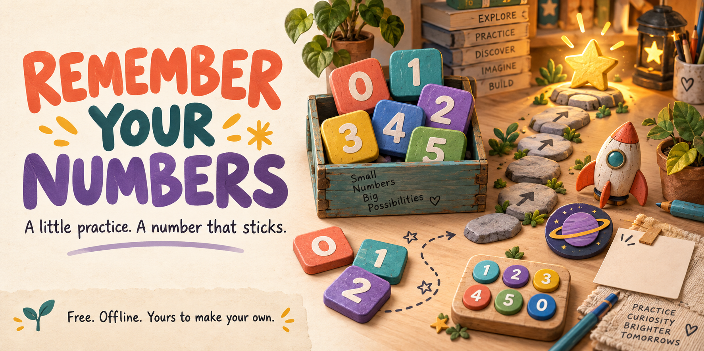
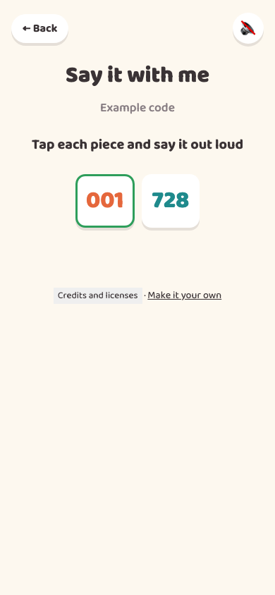

# Remember Your Numbers



**Learn an important number a piece at a time.** Start by tapping its colored chunks, spot the missing piece, fill in the ending, then try the whole thing from memory. Come back later to prove it stuck.

**[Try the game](https://jessemaddox.com/projects/remember-your-numbers/play/)** · **[Download the offline game](https://github.com/jessecmaddox3/remember-your-numbers/releases/latest/download/Remember-Your-Numbers.html)**

I built this for my own personal use, around the way I wanted to practice important numbers. Make it your own, and feel free to improve mine. Hopefully it gives you a useful starting point, or at the very least some ideas. Cheers!

## Start in a minute

1. Press **Try the game**, or download **Remember-Your-Numbers.html** and double-click it to open it in your browser.
2. Choose **Nova** or **Orion** to try the fictional examples. For your own version, press **Add my own numbers**, fill in a nickname, a label, the digits, and the chunk sizes, then press **Save setup**.
3. Pick your learner and number. Tap the pieces or use the big keypad. On a computer, the number keys work too.

For a ten-digit number, chunk sizes **3, 3, 4** make three pieces. Leading zeros stay exactly as entered. Every learner can have several numbers.

No account, terminal, installation, or AI subscription is needed. The downloaded HTML contains the complete game and its font, so it works without the internet. If it opens as text, right-click it, choose **Open with**, and select your browser. On a phone, the Try the game link is usually easier.

## A few small steps

- **Say it with me:** tap every chunk twice, and say it yourself. Optional speech can read the digits.
- **Spot the missing piece:** choose the right chunk from three close alternatives.
- **Fill it in:** practice the ending first, then gradually fill in more of the number.
- **Recall:** type it with a first-digit hint, then without one.
- **Prove it:** return at least 20 hours after the first cold pass. A clean recall marks it mastered.
- **Keep it fresh:** reviews begin two days later, doubling after each successful review up to 30 days. A missed review brings the interval back to two days.

Short sessions work well with the design: finish a challenge or two and come back. The [design notes](docs/design.md) explain the full progression and the exact rules.



The hero is fictional artwork generated with ChatGPT. The image above is the actual game using invented data.

## Your numbers, your browser

The game sends no numbers to a server and has no analytics or account system. Your setup and progress are saved in this browser when safe local storage is available. Use a private device: someone using the same browser can open the same numbers.

In **Setup and backups**, press **Export backup** whenever you make changes. The downloaded JSON file contains your learners, numbers and progress in readable text, so keep it private. **Import a backup** validates the file and asks before replacing the saved setup. Clearing browser data can erase your saves. Different browsers, devices, website addresses and downloaded copies can keep separate saves; a backup lets you move them.

If safe storage is unavailable, the game clearly says the session is temporary and still lets you export. If another tab changes or erases the saved setup, the older tab stops saving and offers **Reload current setup** or an explicit export of its older copy. It cannot silently restore the erased numbers.

**Sound starts off.** When enabled, the app only selects voices the browser reports as local. If none is available, it stays silent. Availability and voice handling depend on the browser and operating system; the app does not use a cloud speech service. You can simply say the pieces yourself.

## Make it yours

The original code and documentation use the [MIT license](LICENSE). Use, change, share, or sell your version, keeping the notice. The font and build tool keep their [own notices](THIRD_PARTY_NOTICES.md).

To download the source without Git, use GitHub's green **Code** button, choose **Download ZIP**, then unzip it. You can open `public/index.html` directly to play the included build. Personal setup belongs in the game's local form, not in a published source file.

For code changes, install Node.js 22 or newer, open a terminal in the unzipped project folder, and run:

```sh
npm ci
npm run build
npm start
```

Open the address printed in the terminal. Press **Ctrl+C** to stop. After editing source, run **npm run build** again. It rebuilds `public/dist/app.js` and the complete offline file at `artifacts/Remember-Your-Numbers.html`.

Useful starting points:

- `public/logic.mjs`: chunks, learning stages, mastery and review timing.
- `public/state.mjs`: setup validation and progress tied to the actual number.
- `public/persistence.mjs`: coordinated saves and conflict detection.
- `public/app.js`: screens, controls, speech and local setup.
- `public/style.css`: the original warm, rounded visual style.

Host the `public/` folder under any root or repository subpath. An HTTPS address or localhost enables coordinated browser saves. If you use an AI coding assistant, give it [the adaptation skill](skills/adapt-remember-your-numbers/SKILL.md) and describe what you want to change.

## Checks and contributions

```sh
npm test
npm run build
python3 scripts/test-browser.py
```

The browser suite needs Python Playwright 1.58.0 and its Chromium browser. [Verification instructions and tested limits](docs/verification.md).

Ideas, bug reports and improvements are welcome. Clearer setup, additional keyboard support, and broader real-device testing are useful places to start. [Contribution guide](CONTRIBUTING.md).
